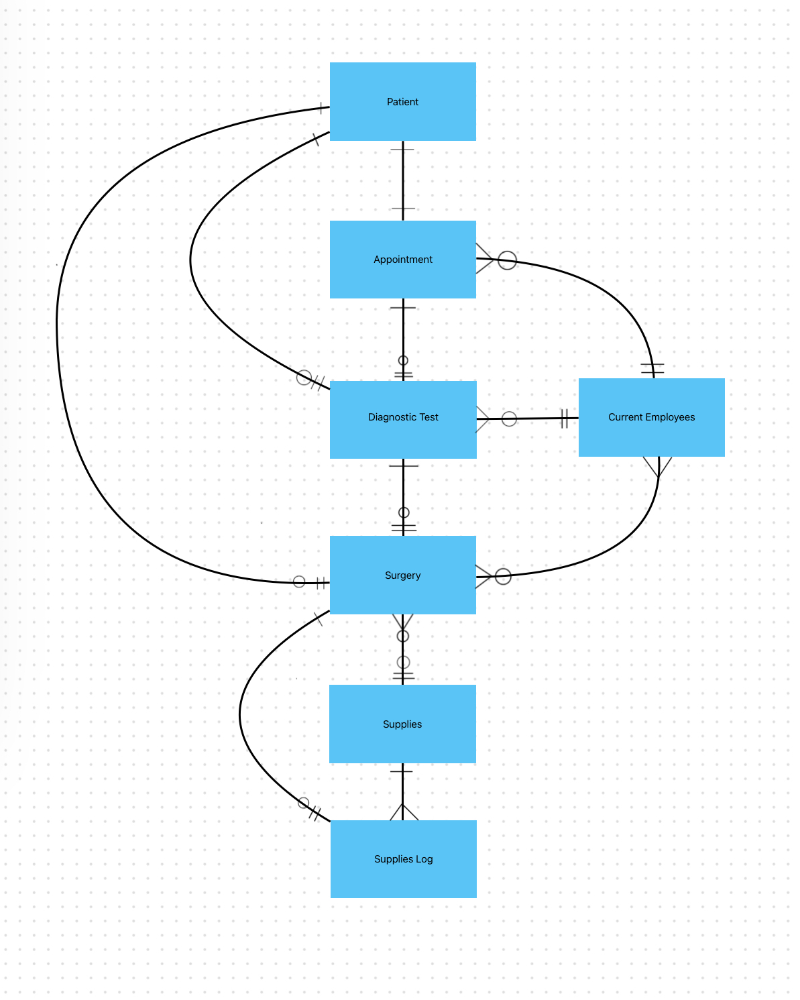

# CS50SQL-Final-Project
Tracey's CS50SQL Final Project

███╗░░██╗░█████╗░██████╗░████████╗██╗░░██╗
████╗░██║██╔══██╗██╔══██╗╚══██╔══╝██║░░██║██╔██╗██║██║░░██║██████╔╝░░░██║░░░███████║
██║╚████║██║░░██║██╔══██╗░░░██║░░░██╔══██║██║░╚███║╚█████╔╝██║░░██║░░░██║░░░██║░░██║
╚═╝░░╚══╝░╚════╝░╚═╝░░╚═╝░░░╚═╝░░░╚═╝░░╚═╝

░██████╗██╗░░░██╗██████╗░██╗░░░██╗██████╗░██████╗░░█████╗░███╗░░██╗
██╔════╝██║░░░██║██╔══██╗██║░░░██║██╔══██╗██╔══██╗██╔══██╗████╗░██║
╚█████╗░██║░░░██║██████╦╝██║░░░██║██████╔╝██████╦╝███████║██╔██╗██║
░╚═══██╗██║░░░██║██╔══██╗██║░░░██║██╔══██╗██╔══██╗██╔══██║██║╚████║
██████╔╝╚██████╔╝██████╦╝╚██████╔╝██║░░██║██████╦╝██║░░██║██║░╚███║
╚═════╝░░╚═════╝░╚═════╝░░╚═════╝░╚═╝░░╚═╝╚═════╝░╚═╝░░╚═╝╚═╝░░╚══╝

██╗░░██╗░█████╗░░██████╗██████╗░██╗████████╗░█████╗░██╗░░░░░
██║░░██║██╔══██╗██╔════╝██╔══██╗██║╚══██╔══╝██╔══██╗██║░░░░░
███████║██║░░██║╚█████╗░██████╔╝██║░░░██║░░░███████║██║░░░░░
██╔══██║██║░░██║░╚═══██╗██╔═══╝░██║░░░██║░░░██╔══██║██║░░░░░
██║░░██║╚█████╔╝██████╔╝██║░░░░░██║░░░██║░░░██║░░██║███████╗
╚═╝░░╚═╝░╚════╝░╚═════╝░╚═╝░░░░░╚═╝░░░╚═╝░░░╚═╝░░╚═╝╚══════╝

Video overview: https://youtu.be/Sq8dK6YhrOg

## Scope

This database is database that is designed to be a patient tracking system for the fictional North Suburban hospital.
The database includes support for patient admission and discharge (by using insert and delete), and other functions necessary for the operations of the hospital. The databases' scope includes:

* Patient: unique patient identifying information, room number and health information.
* Appointment: scheduling, personnel assignment, recommended diagnostic tests and insurance handling.
* Current Employees: unique employee information, job title and notes.
* Diagnostic test: imaging scheduling, test type, personnel assignment and recommended surgeries.
* Surgery: scheduling, personnel assignment, department, supplies requisition and department.
* Supplies: Medications and substances the hospital stores.
* Supplies Log: A table that keeps track of supplies requisitions.

Things that are outside the scope of this database include: Hospital Transfers and
Patient Department/Department referrals.

## Functional Requirements

In this section you should answer the following questions:

* This database allows for users to CREATE, READ, UPDATE and DELETE tables.
* This database allows for resources allocated to patients to be tracked and recorded.
* This database allows for physician, surgeon and technician tracking based on patient, time and/or test if applicable.

## Representation

This database's schmea is designed for SQLITE

### Entities

The `patients` table includes:

*   `unique_patient_id`, This id is unique to each patient that comes to the hospital to allow for recording of health care providers who have cared for the patient and services rendered. This is the primary key of the table

*   `first_name`, This allows for personalization of patients and is meant to assist personnel
in maintaining a reputable bedside manner.

*   `last_name`, This helps distinguish between patients that share the same first namee

*   `emergent`, This is useful for triage, if this value is true, the patient requires more
immediate attention that a patient who has only a urgent medical need.

*  `urgent`, This also helps with triage as a patients who's medical state is urgent but not
emergent can be referred to another hospital or seen later than a person who's medical needs
are emergent depending of the severity of injury or illness.

*   `complaints`, This is useful for medical providers who are seeing the patient after they've been triaged and admitted and can help the physician with making a diagnosis.

*   `insurance`, Useful for the hospital to ensure patients insurances are billed.

*   `prescriptions` Useful for sending presciptions to pharmacies.

*   `diagnosis`, This useful for surgeons, nurses and test technicians and may inform them of the best way to treat the patient.

*   `medical_history`, This is useful for the Physician when they are making a diagnosis, it is also helpful for the surgeon if/when they need to operate on the patient.

*   `heart_rate`, A vital sign that is useful for triage

*   `blood_pressure`, A vital sign that is useful for triage

*   `blood_oxygen_level`, A vital sign that is useful for triage

*   `room_number`, Helps to return the patient to their room after surgery, test or admission.

*   `appointment_id`, The unique appointment number for the patient to meet with a physician and nurse, this is a foreign key which references the "appointments" table.

The `current_employees` table includes:

*    `unique_employee_id` This is meant to be the primary way of tracking employees internally. This is the primary key of this table.

*   `first_name` This is meant to help with personalization of personnel.

*   `last_name` This column helps to distinguish between personnel that share the same first name.

*   `job`, The role or title the employee serves/has at the hospital.

*   `start_date`, The date the employee started working at the Hospital.

*   `end_date`, May be null, helps with employee tracking.

*   `notes`, Internal notes referring to employee performance and record.

The `surgeries` table includes:

*   `name`, The name of the type of procedure being performed.

*   `elective`, Indicates whether the surgery is necessary.

*   `potential_complications`, A list of negative consequences that can arise because of the surgery.

*   `patient_first_name`, Helps surgoens and personnel create rapport with the patient.

*   `patient_last_name`, Helps to identify the patient.

*   `patient_unique_id`, The primary means of patient identification a foreign key and required for a surgery to be scheduled.

*   `surgeon_first_name`, Helps keep track of the surgeon of record, a required constraint.

*   `surgeon_last_name`, Helps to indentify the surgeon of record, a required constraint.

*   `secondary_surgeon_first_name`, Helps to keep track of involved personmel.

*   `secondary_surgeon_last_name`, Helps to keep track of involved personnel.

*   `nurse_first_name`, Helps to keep track primary nurse of record this is required to make sure a surgery has the requisite personnel.

*   `nurse_last_name`, Helps to keep track of primary nurse of record this is required to make sure a surgery has the requisite personnel.

*   `secondary_nurse_first_name`, This helps to keep track of the supporting nurse.

*   `secondary_nurse_last_name`, This helps to keep track of the supporting nurse.

*   `surgeon_employee_id`, The primary means of surgeon identification this is required to make sure a surgery has the requisite personnel.

*   `secondary_surgeon_employee_id`, the primary means of identifying the supporting physician this is required to make sure a surgery has the requisite personnel.

*   `nurse_employee_id`, the primary means of identifying the nurse of record this is required to make sure a surgery has the requisite personnel.

*   `secondary_nurse_employee_id`, the primary means of identifying the supporting nurse this is required to make sure a surgery has the requisite personnel.

*   `supplies_requisition_full_name`, Chemical name of medicines required for surgery.

*   `supplies_requisition_common_name`, Colloquial name of medicines required for surgery.

*   `secondary_supplies_requisition_full_name` Chemical name of additional required medicines.

*   `secondary_supplies_requisition_common_name` Colloquial name of additional medicines required.

*   `Department`, The department which is performing the surgery

The `diagnostic_test` table includes:

*   `unique_test_id`, The unique identifier for each diagnostic test performed, this is the primary key for this table

*   `unique_patient_id`, The unique identifier for each patient, this is a forerign key which references the `patients` table.

*   `patient_first_name`, The first name of the patient, useful for building rapport with the patient.

*   `patient_last_name`, The last name of the patient, useful for identification more readily accessible than the unique_patient_id

*   `technician_employee_id`, The unique employee id of technician, this is a foreign key which references the `current_employees` table

*   `technician_first_name`, The first name of the technician may help with building technician-patient rapport.

*   `technician_last_name`, Similar to the last name of the patient, useful for identification more readily accessible than the unique employee id

*   `date` DATETIME, The time/date the test is scheduled

*   `type`, the type of test being done, e.g. X-ray, MRI, CAT, etc.

*  `requesting_physician_id` , The id of the physician requesting the scan, this is a foreign key which references the `current_employees` table.

*   `recommended_surgery`, The primary surgery recommended from the results of the test, this is a foreign key on the `surgery` table.

*   `secondary_recommended_surgery`, The secondary surgery recommended on the results of the test. This is a foreign key on the `surgery_table`.

The `appointments` table includes:

*   `appointment_id`, The primary key of the appointments table serves as a unique identifier for each appointment.

*   `patient_first_name`, The first name of the patient.

*    `patient_last_name`, The last name of the patient.

*    `unique_patient_id`, The unique identifier for the patient, this is a foreign key which references the `patients` table.

*    `physician_first_name`, The first name of the treating physician.

*    `physician_last_name`, The last name of the treating physician.

*    `physician_employee_id`, The unique employee id of the treating physician, this is a foreign key which references the `current_employees` table.

*    `nurse_first_name`, The first name of the treating nurse.

*    `nurse_last_name`, The last name of the treating nurse.

*    `nurse_employee_id`, The unique employee id of the treating nurse, this is a foreign key which references the `current_employees` table.

*    `date`, The date the appointment is scheduled.

*    `notes`, Notes the patient may have had.

*    `insurance`, Insurance provider the patient is using.

*    `recommended_test`, The main diagnostic test recommnded as a result of this appointment, a foreign key on the type column of the `diagnostic_test` table.

*    `recommended_test_id`, The unique test id, a foreign key on the `diagnostic_test` table.

*    `secondary_recommended_test` A diagnostic test recommnded as a result of this appointment, a foreign key on the type column of the `diagnostic_test` table.

*    `secondary_recommended_test_id`, The unique test id, a foreign key on the `diagnostic_test` table.

The `supplies` table includes:

*    `unique_product_id`, The unique product identifier for the product/medicine in question. This is the primary key for the `supplies` table.

*    `full_name`, The full chemical name of the supply in question.

*    `common_name`, The colloquial name of the medicine in question.

The `supplies_log` table includes:

*    `log_id`, the primary key of this table and unique of id of each requisition of each item in supplies.

*    `unique_product_id`, The primary way of recording what product was requisitioned, this is a foreign key which references the `supplies` table.

*    `full_name`, Chemical name of the item requisitioned.

*    `common_name`, The colloquioal name of the item requisitioned.

*    `second_full_name`, Chemical name of the additional item requisitioned.

*    `second_common_name`, The colloquioal name of the additional item requisitioned.

*    `intended_purpose`, The intended use of the supply being requisitioned, helps keep track of why supplies and for which surgeries supplies have been requested.

### Relationships

The relationship between the tables in this database are:

* A patient is associated with one appointment. Patients are not assigned personnel, rather personnel are assigned to appointments, diagnostic tests or surgery that are scheduled for the patient. A patient may be associated with up to two surgeries, and two diagnostic tests.

* An appointment has only one patient and has two personnel, a physician and nurse assigned to it/two employees from the current_employees are associated. An appointment may have between zero and two follow up diagnostic test associated with it.

* Diagnostic tests, must be associated with two personnel, the requesting physician and the technician that performs the test. A diagnostic test can only be associated with one appointment though the opposite is not necessarily true. A diagnostic test can be associated with between zero and two recommended follow-up surgeries. A diagnostic test must be associated with one patient.

* Current Employees, may have no appointments or many appointments scheduled. Employees may have none or many appointments scheduled, and between 0 and many surgeries scheduled.

* Surgeries need many (4) employees to be in the surgery table. Surgeries also must be associated with one diagnostic test. A surgery can require up to two medical supplies from the hospital "supplies" table. A surgery can be associated with only one patient. Additionally a surgery can have between 0 and 2 logs associated with it in the supplies log table.

* Items in the supplies table may be associated with many surgeries. Additionally, an item in the supplies table may be associated with many different supply log entries.

* Supplies Log entries are only associated with one item in the supplies table and one surgery in the surgeries table. It records individual request from the surgery table using a trigger.

## Optimizations

* Indexes were created for patient names and employee names in the `patients`, `current_employees`, `appointments`, `surgeries` and `diagnostic_test` tables to facilitate quick requisition of data using patient and employees names.

## Limitations

* This design does not include a table for former employees, deceased patients, and supplies number. It also does not provide a method to record secondary surgeons, physcians, nurses and technicians.
